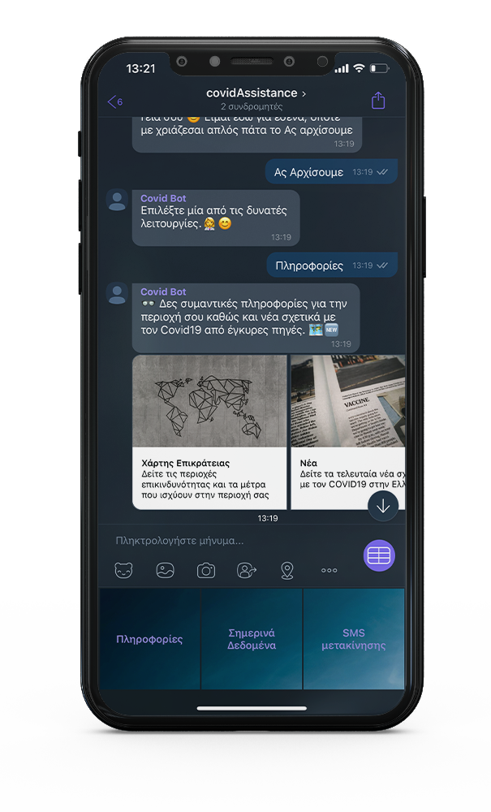

# Viber Bot for Covid19 

This is a Viber bot project that deals with Covid19 releated questions.

  

---
## Requirements

For development, you will only need Node.js and a node global package installed in your environement.

### Node
- #### Node installation on Windows

  Just go on [official Node.js website](https://nodejs.org/) and download the installer.
Also, be sure to have `git` available in your PATH, `npm` might need it (You can find git [here](https://git-scm.com/)).

- #### Node installation on Ubuntu

  You can install nodejs and npm easily with apt install, just run the following commands.

      $ sudo apt install nodejs
      $ sudo apt install npm

- #### Other Operating Systems
  You can find more information about the installation on the [official Node.js website](https://nodejs.org/) and the [official NPM website](https://npmjs.org/).

If the installation was successful, you should be able to run the following command.

    $ node --version
    v8.11.3

    $ npm --version
    6.1.0

If you need to update `npm`, you can make it using `npm`! Cool right? After running the following command, just open again the command line and be happy.

    $ npm install npm -g

###

---

## Install

    $ git clone https://github.com/DimitriosGkegkas/ViberBot-Covid19.git
    $ cd ViberBot-Covid19
    $ npm install

## Configure ngrok

Run 

    $ ngrok http 3000
    
You should be getting something like this 

Just copy the mapped https url and paste it in "./secret/url.ts"
Do not close this terminal.

## Running the project
In a new terminal Run

    $ npm start

And now you should be able to talk with the chat bot. Just scan the QR Code below if you are using my Viber Chat Bot Account 

or just change the viber token to one of yours, in the file "./secret/viber.ts.".

If you want, you can create one [here](https://partners.viber.com/login?returnUrl=%2Faccount%2Fcreate-bot-account)

